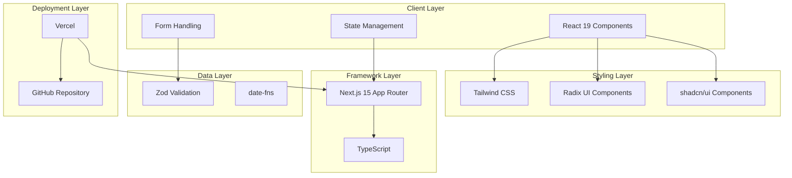

# Customer Management System

<p align="center">
  
  
  
  
  
</p>

<p align="center">
  <a href="https://vercel.com/gileb64375-5584s-projects/v0-customer-management">
    
  </a>
  <a href="https://v0.app/chat/projects/a2OMIccZ0Su">
    
  </a>
</p>

---

## Table of Contents

- [Overview](#overview)
- [Features](#features)
- [System Architecture](#system-architecture)
- [Tech Stack](#tech-stack)
- [Configuration](#configuration)
- [Getting Started](#getting-started)
- [Project Statistics](#project-statistics)
- [License](#license)

---

## Overview

> **Customer Management System** is a comprehensive web application built with modern technologies for managing customer data, contracts, and interactions. The system provides a Japanese-language interface with robust features for customer information management.

This application is automatically synced with [v0.app](https://v0.app) deployments. Any changes made to the deployed app are automatically pushed to this repository.

---

## Features

### Core Functionality

- **Customer Data Management** - View and manage customer information including:
  - Gender (性別)
  - Date of Birth (生年月日)
  - Customer ID (顧客番号)
  - Customer Status (顧客状況)
  - Address (住所)
  - Full Name (氏名)
  - Phone Numbers (電話番号)

- **Contract & Transaction History** - Track customer interactions:
  - Date range filtering with month selectors
  - Communication records display
  - Read/Unread status indicators
  - Edit functionality for each record

- **Multi-level Navigation** - Sidebar navigation with:
  - Home (ホーム)
  - Customer Information (客户情報)
  - ID Verification (身分証明書)
  - Customer Ranking (顧客ランク)
  - Administration (管理)
  - Alerts (アラート)

### UI/UX Features

- **Responsive Design** - Fully responsive layout that works on all screen sizes
- **Red Header Bar** - System status bar with navigation links (マニュアル/FAQ, お知らせ, ログアウト)
- **Sidebar Navigation** - Left-side navigation with icon indicators
- **Card-based Layout** - Clean card components for organized data display
- **Interactive Elements** - Hover states, clickable buttons, and form controls

---

## System Architecture



---

## Tech Stack

### Core Technologies

| Technology | Version | Purpose |
|------------|---------|---------|
| **Next.js** | 15.2.4 | React framework with App Router |
| **React** | 19 | UI library |
| **TypeScript** | 5.x | Type-safe JavaScript |
| **Tailwind CSS** | 3.4.17 | Utility-first CSS framework |

### UI Components

| Library | Version | Description |
|---------|---------|-------------|
| **Radix UI** | 1.x | Headless UI primitives |
| **shadcn/ui** | Latest | Accessible component library |
| **Lucide React** | 0.454.0 | Icon library |
| **Recharts** | 2.15.0 | Charting library |

### Form & Validation

| Library | Version | Purpose |
|---------|---------|-------------|
| **React Hook Form** | 7.54.1 | Form state management |
| **Zod** | 3.24.1 | Schema validation |
| **@hookform/resolvers** | 3.9.1 | Form resolver for Zod |

### Utilities

| Library | Version | Purpose |
|---------|---------|-------------|
| **date-fns** | 4.1.0 | Date manipulation |
| **clsx** | 2.1.1 | Conditional class names |
| **tailwind-merge** | 2.5.5 | Tailwind class merging |
| **class-variance-authority** | 0.7.1 | Class variance utility |
| **next-themes** | 0.4.4 | Theme management |

### Dev Dependencies

| Tool | Version | Purpose |
|------|---------|---------|
| **ESLint** | Built-in | Code linting |
| **PostCSS** | 8.5 | CSS processing |
| **Autoprefixer** | 10.4.20 | CSS vendor prefixes |

---

## Configuration

### Next.js Configuration (`next.config.mjs`)

```javascript
{
  eslint: {
    ignoreDuringBuilds: true,    // Ignore ESLint errors during build
  },
  typescript: {
    ignoreBuildErrors: true,     // Ignore TypeScript errors during build
  },
  images: {
    unoptimized: true,          // Disable image optimization
  }
}
```

### Tailwind Configuration (`tailwind.config.js`)

- **Content Paths**: `./pages/**/*.{ts,tsx}`, `./components/**/*.{ts,tsx}`, `./app/**/*.{ts,tsx}`, `./src/**/*.{ts,tsx}`, `*.{js,ts,jsx,tsx,mdx}`
- **Custom Colors**: Extended color palette with border, input, ring, background, foreground, primary, secondary, destructive, muted, accent, popover, card
- **Container**: Centered with 2rem padding, 2xl breakpoint at 1400px

### TypeScript Configuration (`tsconfig.json`)

- Strict mode enabled
- Next.js specific configurations
- Path aliases configured (@/* alias)

---

## Getting Started

### Prerequisites

- **Node.js** - v18.0.0 or higher
- **Package Manager** - pnpm (preferred), npm, or yarn
- **Git** - For version control

### Installation

```bash
# Clone the repository
git clone <repository-url>
cd customer-management

# Install dependencies
pnpm install
# or
npm install
# or
yarn install
```

### Development Commands

| Command | Description |
|---------|-------------|
| `pnpm dev` | Start development server |
| `pnpm build` | Build for production |
| `pnpm start` | Start production server |
| `pnpm lint` | Run ESLint |

### Development Server

```bash
# Start the development server
pnpm dev

# The app will be available at:
# http://localhost:3000
```

### Build for Production

```bash
# Create optimized production build
pnpm build

# Start the production server
pnpm start
```

---

## Project Statistics

| Metric | Value |
|--------|-------|
| **Total Files** | 36+ files |
| **Main Components** | 3 (Layout, Page, UI) |
| **UI Components** | 10+ shadcn/ui components |
| **Total Dependencies** | 40+ packages |
| **CSS Framework** | Tailwind CSS 3.4 |
| **Deployment** | Vercel |

### Project Structure

```
customer-management/
├── app/                    # Next.js App Router
│   ├── layout.tsx         # Root layout
│   ├── page.tsx          # Main page
│   └── globals.css       # Global styles
├── components/            # React components
│   ├── ui/               # shadcn/ui components
│   │   ├── button.tsx
│   │   ├── card.tsx
│   │   ├── select.tsx
│   │   └── theme-provider.tsx
│   └── ...
├── lib/                   # Utility functions
│   └── utils.ts          # cn() utility
├── public/                # Static assets
├── styles/               # Additional styles
├── package.json          # Dependencies
├── tailwind.config.js    # Tailwind configuration
├── tsconfig.json         # TypeScript configuration
├── next.config.mjs       # Next.js configuration
└── postcss.config.mjs    # PostCSS configuration
```

---

## Deployment

### Live Application

The application is deployed on Vercel and available at:

**🚀 [https://vercel.com/gileb64375-5584s-projects/v0-customer-management](https://vercel.com/gileb64375-5584s-projects/v0-customer-management)**

### Build Status

- **Platform**: Vercel
- **Auto-Deploy**: Enabled on push to main branch
- **Framework**: Next.js

---

## License

This project is licensed under the **MIT License**.

---

## Additional Resources

- [Next.js Documentation](https://nextjs.org/docs)
- [Tailwind CSS Documentation](https://tailwindcss.com/docs)
- [Radix UI Components](https://www.radix-ui.com/)
- [shadcn/ui Components](https://ui.shadcn.com/)
- [Vercel Deployment](https://vercel.com/docs)

---

<p align="center">
  <strong>Built with ❤️ using Next.js, React, TypeScript, and Tailwind CSS</strong>
</p>

---

<p align="center">
  <strong>Built by Girish Lade</strong> — <a href="https://ladestack.in">ladestack.in</a>
</p>